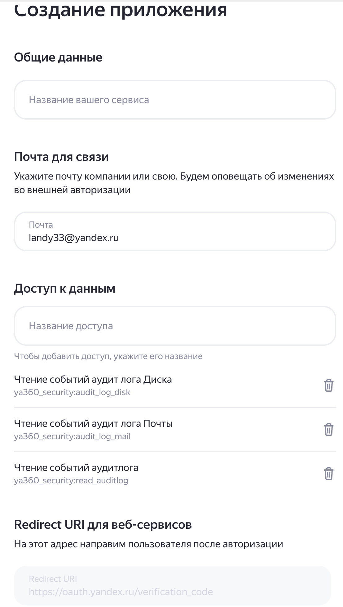
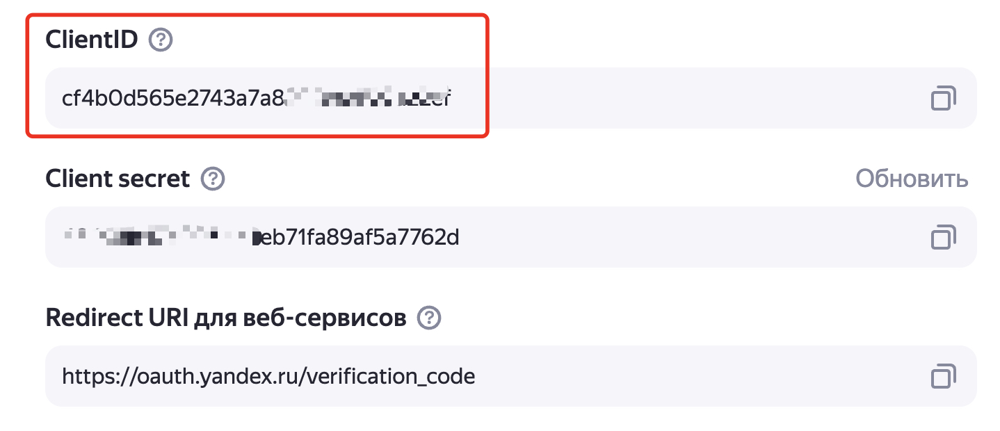

# Yandex 360 Text Admin Console

## Обзор

Консольная утилита [`360_text_admin_console.py`](360_text_admin_console.py:1) предназначена для администрирования организации Yandex 360 через API. Утилита предоставляет широкий функционал для управления пользователями, группами, настройками электронной почты и двухфакторной аутентификации.

## Основные возможности

### 1. Управление атрибутами пользователей
- Изменение атрибута `userName` через SCIM API
- Изменение атрибута `nickname` через Yandex 360 API
- Массовое обновление пользователей из CSV-файла
- Проверка псевдонимов и алиасов

### 2. Получение информации о пользователях
- Выгрузка всех пользователей в CSV-файлы (SCIM и API 360)
- Детальная информация об атрибутах пользователя
- Проверка существования псевдонимов

### 3. Управление группами
- Просмотр атрибутов групп
- Управление разрешениями на отправку в группы
- Добавление/удаление пользователей в списки разрешенных отправителей
- Работа с общими почтовыми ящиками

### 4. Настройки электронной почты
- Управление настройками отправителя по умолчанию
- Просмотр и очистка правил пересылки
- Массовое обновление настроек из файла
- **НОВОЕ:** Получение подписи пользователя в отправляемых письмах
- **НОВОЕ:** Массовая установка подписей пользователям с параметризированными шаблонами

### 5. Двухфакторная аутентификация (2FA)
- Выгрузка настроек 2FA для всех пользователей
- Сброс телефона безопасности
- Принудительный выход пользователей из системы
- Принудительный выход пользователей с включенной 2FA без настроенного телефона

## Установка

1. **Установите Python 3.7 или выше**

2. **Установите зависимости:**
   ```bash
   pip install -r requirements.txt
   ```

3. **Настройте файл окружения:**
   Создайте файл [`.env`](.env:1) в корневой директории проекта со следующими параметрами:

## Параметры конфигурации

| Параметр | Описание | Обязательный | Пример |
|----------|----------|--------------|--------|
| `SCIM_TOKEN_ARG` | OAuth-токен для SCIM API | Да* | `y0_AgAAAAAAAAAAAA` |
| `SCIM_DOMAIN_ID_ARG` | ID домена для SCIM API | Да* | `1234567` |
| `OAUTH_TOKEN_ARG` | OAuth-токен для Yandex 360 API | Да | `y0_AgAAAAB0It5oAAvg` |
| `ORG_ID_ARG` | ID организации Yandex 360 | Да | `1234567` |
| `USERS_FILE_ARG` | Имя CSV-файла с пользователями | Да | `users.csv` |
| `NEW_LOGIN_DEFAULT_FORMAT_ARG` | Шаблон нового userName | Нет | `alias@domain.ru` |
| `DEFAULT_EMAIL_OUTPUT_FILE_ARG` | Файл для экспорта настроек email | Нет | `default_email_output.csv` |
| `DEFAULT_EMAIL_INPUT_FILE_ARG` | Файл для импорта настроек email | Нет | `default_email_input.csv` |
| `DEFAULT_FORWARD_RULES_OUTPUT_FILE_ARG` | Файл для экспорта правил пересылки | Нет | `forward_rules_output.csv` |
| `DEFAULT_2FA_SETTINGS_OUTPUT_FILE_ARG` | Файл для экспорта настроек 2FA | Нет | `users_2fa_output.csv` |
| `DEFAULT_2FA_SETTINGS_INPUT_FILE_ARG` | Файл для импорта настроек 2FA | Нет | `users_2fa_input.csv` |
| `EMAIL_SIGNATURE_FILE_PREFIX_ARG` | **НОВОЕ:** Префикс для файлов, где сохраняется подпись, выгруженная из Яндекс 360 | Нет | `signature_` |
| `EMAIL_SIGNATURE_INPUT_FILE` | **НОВОЕ:** Файл с пользователями для установки подписей | Нет | `users_signature_input.csv` |
| `EMAIL_SIGNATURE_TEMPLATE_FILE` | **НОВОЕ:** Шаблон подписи (HTML) | Нет | `signature_template.html` |
| `EMAIL_SIGNATURE_LANGUAGE` | **НОВОЕ:** Язык подписи | Нет | `ru` |
| `EMAIL_SIGNATURE_IS_DEFAULT` | **НОВОЕ:** Подпись по умолчанию | Нет | `false` |
| `EMAIL_SIGNATURE_POSITION` | **НОВОЕ:** Позиция подписи | Нет | `bottom` или `under` |
| `IgnoreUsernameDomain` | Игнорировать домен в userName | Нет | `true/false` |

*\* SCIM параметры необходимы только для операций с userName*

### Пример файла `.env`:
```env
SCIM_TOKEN_ARG=y0_AgAAAAAAAAAAAA
SCIM_DOMAIN_ID_ARG=1234567
OAUTH_TOKEN_ARG=y0_AgAAAAB0It5oAAvg
ORG_ID_ARG=1234567
USERS_FILE_ARG=users.csv
NEW_LOGIN_DEFAULT_FORMAT_ARG=alias@domain.ru
```

## Запуск

### Интерактивный режим
```bash
python 360_text_admin_console.py
```

### Командная строка
```bash
# Изменение userName
python 360_text_admin_console.py old_username new_username userName yes

# Изменение nickname
python 360_text_admin_console.py old_nickname new_nickname nickname yes
```

## Структура меню

### Главное меню
1. **Работа с атрибутами userName и nickname**
2. **Получение информации о пользователях**
3. **Получение информации о группах и управление разрешениями**
4. **Работа с настройками электронной почты**
5. **Настройки 2FA**

### Подменю 1: Атрибуты пользователей
1. Установка формата нового userName
2. Создание файла данных SCIM для модификации
3. Массовое изменение userName из файла
4. Ручное изменение userName
5. Изменение nickname пользователя
6. Проверка псевдонима
7. Сохранение атрибутов пользователя в файл
8. Выгрузка всех пользователей

### Подменю 2: Информация о пользователях
1. Проверка псевдонима
2. Выгрузка всех пользователей
3. Детальная информация об атрибутах пользователя

### Подменю 3: Управление группами
1. Сохранение атрибутов группы в файл
2. Просмотр разрешенных отправителей
3. Управление разрешениями на отправку

### Подменю 4: Настройки электронной почты
1. Создание файла для изменения настроек отправителя
2. Обновление настроек из файла
3. Просмотр правил пересылки для пользователя
4. Выгрузка правил пересылки для всех пользователей
5. Очистка правил пересылки
6. **НОВОЕ:** Получение подписи пользователя
7. **НОВОЕ:** Массовая установка подписей пользователям

### Подменю 5: Настройки 2FA
1. Выгрузка настроек 2FA для всех пользователей
2. Просмотр настроек 2FA для пользователя
3. Сброс телефона безопасности
4. Принудительный выход пользователя
5. Принудительный выход пользователей из файла
6. Выход пользователей с 2FA без телефона

## Форматы файлов

### CSV-файл пользователей (users.csv)
```csv
uid;displayName;old_userName;new_userName
1130000069123456;Иванов Иван;ivan@contoso.com;ivan@contoso.ru
1130000069123457;Петров Петр;petr@contoso.com;petr@contoso.ru
```

### CSV-файл настроек email
```csv
nickname;new_DefaultEmail;new_DisplayName;old_DefaultEmail;old_DisplayName;uid
ivan;ivan@newdomain.com;Иван Иванов;ivan@olddomain.com;Ivan;1130000069123456
```

### CSV-файл настроек 2FA
```csv
uid;nickname;displayName;isEnabled;isAdmin;domain2FAEnabled;hasSecurityPhone;personal2FAEnabled;global2FAEnabled;global2FADuration;global2FAPolicy
1130000069123456;ivan;Иванов Иван;true;false;true;false;false;true;86400;all_users
```

### CSV-файл пользователей для установки подписей
```csv
# Пример входного файла для установки подписей
# Строки, начинающиеся с #, игнорируются
# В каждой строке: алиас, email, id или фамилия пользователя
alavret
ivan.petrov
user@company.com
1130000000000001
Петров
```

## Создание параметризированного шаблона подписи

### Поддерживаемые переменные

В шаблоне подписи можно использовать следующие переменные в двойных фигурных скобках:

| Переменная | Описание | Источник данных |
|------------|----------|-----------------|
| `{{last}}` | Имя | `user.name.last` |
| `{{first}}` | Имя | `user.name.first` |
| `{{middle}}` | Отчество | `user.name.middle` |
| `{{name}}` | Полное имя | `user.name.first + user.name.middle + user.name.last` |
| `{{position}}` | Должность | `user.position` |
| `{{mail}}` | Email адрес | Основной email пользователя (который установлен в Web Почте) |
| `{{telephone}}` | Рабочий телефон | Из контактов пользователя |
| `{{mobile}}` | Мобильный телефон | Из контактов пользователя |
| `{{department}}` | Отдел | Название подразделения |

### Пример HTML шаблона

```html
<div>-- </div>
<div><em>С Уважением,</em></div>
<div> </div>
<div><span style="font-family:'comic sans ms' , sans-serif;font-size:16px;line-height:normal"><strong>{{name}}</strong></span></div>
<div><blockquote><div><span style="color:#4b0082">email</span>: <a href="mailto:{{mail}}" rel="noopener noreferrer">{{mail}}</a></div></blockquote></div>
<div><blockquote><div>Телефон: {{telephone}}</div></blockquote></div>
<div><blockquote><div>мобильный: {{mobile}}</div></blockquote></div>
<div><blockquote><div>Должность: {{position}}, {{department}}</div></blockquote></div>
<div><a href="https://360.yandex.ru">site</a></div>
<div> </div>
<div></div>
```

### Автоматическое удаление пустых полей

Система автоматически удаляет HTML элементы, содержащие пустые переменные:

- Если у пользователя нет мобильного телефона, строка `<div>мобильный: {{mobile}}</div>` будет удалена
- Если у пользователя нет должности, соответствующий блок будет скрыт
- Пустые строки и теги автоматически очищаются

### Создание шаблона

1. **Создайте HTML файл** с расширением `.html`
2. **Используйте переменные** в формате `{{variable_name}}`
3. **Добавьте стили** для красивого оформления
4. **Протестируйте** с разными пользователями

### Примеры шаблонов

#### Простой шаблон
```html
<div><strong>{{name}}</strong></div>
<div>Email: {{mail}}</div>
<div>Телефон: {{telephone}}</div>
<div>Должность: {{position}}</div>
```

#### Корпоративный шаблон
```html
<div style="font-family: Arial, sans-serif; font-size: 12px; color: #333;">
    <div><strong>{{name}}</strong></div>
    <div>{{position}}</div>
    <div>{{department}}</div>
    <div>Email: <a href="mailto:{{mail}}" style="color: #0066cc;">{{mail}}</a></div>
    <div>Телефон: {{telephone}}</div>
    <div>Мобильный: {{mobile}}</div>
</div>
```

## Получение токенов

### SCIM API токен
Если у вас для организации настроен SSO режим
1. Скопируйте SCIM 
2. Создайте приложение с разрешением `passport:scim-api.all`
3. Получите токен через `client_credentials`

### Yandex 360 API токен
#### Настройка OAuth приложения

1. Для использования приложения необходимо сгенерировать OAuth токен для аутентификации в Yandex 360 API. Токен должен содержать необходимые права для выполнения операций управления ресурсами в организации Yandex 360. Документация - [Создание приложения](https://yandex.ru/dev/id/doc/ru/register-client).

Последовательность шагов для создания токена:
* перейдите на https://oauth.yandex.ru/client/new/. Аутентифицируйтесь от имени администратора организации Yandex 360
* В предлагаемом окне выберите "Для доступа к API или отладке" и нажмите "Перейти к созданию".


* заполните поля в форме создания приложения:
  - поле "Название вашего сервиса" - любое название
  - проверьте почту для связи

* добавьте разрешения для токена. Для этого в разделе "Доступ к данным" найдите и добавьте следующие разрешения:

| Название разрешения | Что можно делать |
|-------------------|------------------|
| directory:read_users | читать пользователей|
| directory:read_users | записывать информацию о пользователях|
| directory:read_groups | читать группы |
| directory:write_groups | записывать информацию о группах |
|ya360_admin:mail_read_mail_list_permissions|читать список разрешений на отправку в группу|
|ya360_admin:mail_write_mail_list_permissions|изменять список разрешений на отправку в группу|
| ya360_admin:mail_read_shared_mailbox_inventory | читать общие ящики |
| ya360_security:domain_2fa_write | читать данные о 2FA |
| ya360_security:domain_sessions_read | разлогинить пользователей |
| ya360_admin:mail_read_user_settings | Читать настройки почты пользователей |
| ya360_admin:mail_write_user_settings | Менять настройки почты пользователей |
| directory:read_departments | Чтение информации о подразделениях |
| directory:write_departments | Запись информации о подразделениях |



* нажмите кнопку "Создать приложение"
* закройте окно с предложением пройти верификацию через Госуслуги
* в новом окне "Мои приложения" отображаются свойства созданного приложения. Найдите раздел с ID созданного приложения и скопируйте строку из поля "ClientID":



* в текстовом редакторе создайте строку вида `https://oauth.yandex.ru/authorize?response_type=token&client_id=<ID приложения>` и вставьте скопированное значение ClientID из предыдущего шага вместо `<ID приложения>`

Вставьте получившуюся ссылку в браузер и нажмите "Enter".
* в окне браузера появляется запрос на подтверждение прав токена. Подтверждение **должно выполняться с аккаунта администратора организации** (если это сделать от имени обычного пользователя, токен не получит запрашиваемые права из-за отсутствия необходимых разрешений у данного пользовательского аккаунта).
Нажмите "Войти как" и получите необходимый токен доступа.

> [!WARNING]
> Скопируйте токен и сохраните его в безопасном месте.

2. Получите ID организации в Yandex 360. Для этого перейдите в [консоль администрирования](admin.yandex.ru) и в левом нижнем углу интерфейса будет необходимый номер.


3. Запишите полученные на предыдущем шаге OAuth токен и Org ID в соответствующие переменные в файле `.env` в том же каталоге, что и сами скрипты.

Подробные инструкции по получению токенов см. в [документации Yandex 360](https://yandex.ru/dev/api360/doc/ru/).

## Логирование

- **Консоль**: Сообщения уровня INFO
- **Файл**: [`360_text_admin_console.log`](360_text_admin_console.log:1) с ротацией (10 МБ, 5 копий)
- **Уровень**: DEBUG для файла, INFO для консоли

## Примеры использования

### Массовое изменение userName
```bash
# 1. Создать файл с данными пользователей
python 360_text_admin_console.py
# Выбрать: 1 -> 2

# 2. Отредактировать users.csv
# 3. Применить изменения
python 360_text_admin_console.py
# Выбрать: 1 -> 3
```

### Управление разрешениями группы
```bash
python 360_text_admin_console.py
# Выбрать: 3 -> 3 -> 1 (установить целевую группу)
# Затем: 3 -> 3 -> 2 (добавить пользователей)
```

### Выгрузка настроек 2FA
```bash
python 360_text_admin_console.py
# Выбрать: 5 -> 1
```

## Ограничения и особенности

- Поддерживаются только пользователи с ID, начинающимся с "113"
- SCIM API требует отдельного токена и настройки
- Некоторые операции требуют административных прав
- Массовые операции могут занимать значительное время
- Рекомендуется остановить службу SCIM перед изменением userName

## Обработка ошибок

- Автоматические повторы запросов (до 3 попыток)
- Детальное логирование ошибок
- Валидация входных данных
- Проверка токенов при запуске

## Требования

- Python 3.7+
- Библиотеки из [`requirements.txt`](requirements.txt:1)
- Действующие токены Yandex 360 API
- Права администратора организации

## Поддержка

Для получения поддержки обратитесь к документации Yandex 360 API или создайте issue в репозитории проекта.
